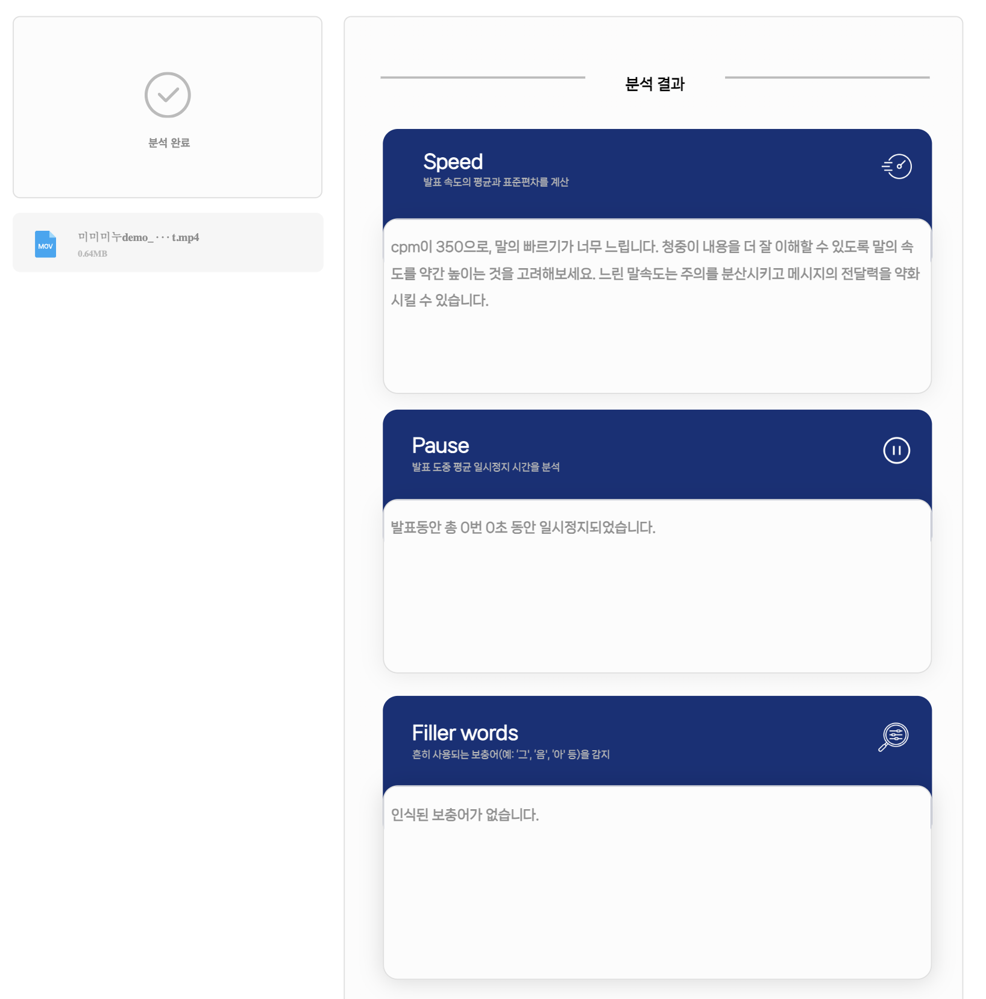
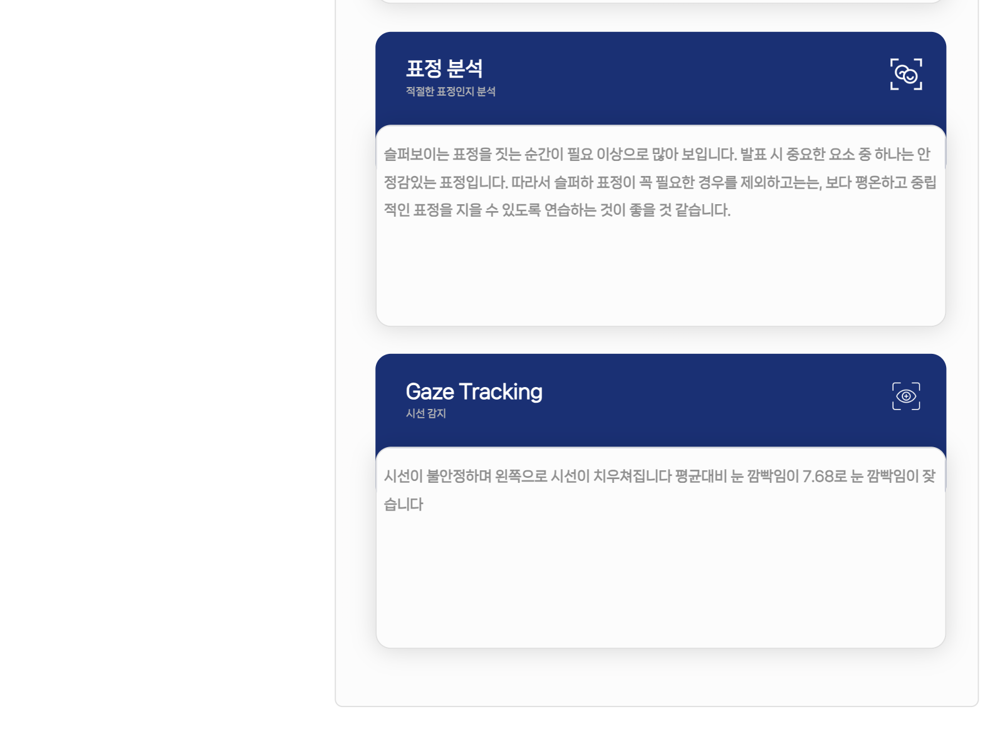
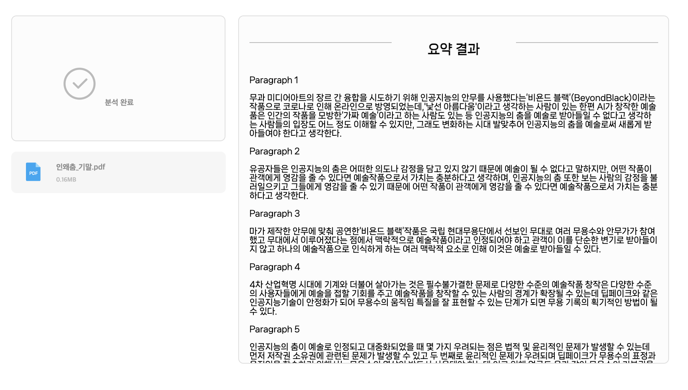

# SpeechPT
프로메테우스 AI 발표연습 어플리케이션 개발

## Table of Contents
* [General info](#general-info)
* [Technologies](#technologies)
* [Setup](#setup)
* [Members](#Members)


## How to Use
1. Clone the repository :
```
git clone https://github.com/use08174/SpeechPT.git
```

2. Install dependencies:
```
pip install -r requirements.txt
```

3. Start the development server:
```
cd SpeechPT/backend/app
uvicorn main:app --reload
```

## Key Features
Our project has two key features: `presentation analysis` and `text summarization`.


## Presentation analysis 
### Speech Analysis
After `STT` using Google STT API, we implemented three functions as follow.

- `Speed` : Calculate cpm to analyze speed of the speech. (cpm : character per minute)
- `Pause` : Calculate number of pauses and duration of pauses during speech.
- `Filler words` : Detect korean filler words in the speech.

### Video Analysis
- `Face Expression` : Analyze face expression of the presenter.
- `Gaze Tracking` : Tracking gaze of the presenter.





## Text summarization
- `Summarize text`
  1) Extract text from a document (pdf,word) and summarize text by paragraph using [`Kobart`](https://github.com/SKT-AI/KoBART) 
  2) Check the spelling and save the final summary to the document




## Our Project Archive
This is our notion page for our project archive. : 
[Notion](https://odd-polyester-d27.notion.site/AI-cdf2556e1b3d4c3698c93cc3a04f139f )

## Members
|멤버이름|역할|
|------|---|
|심수민|Leader, Audio, Backend|
|배아람|Audio, Frontend|
|김수홍|Audio, Frontend|
|문승현|Video, Backend|
|남승현|Video, Backend|
|윤선미|Text, Frontend|
|임서연|Text, Backend|
|안서연|UI Design|


More about Prometheus : https://prometheus-ai.net/
