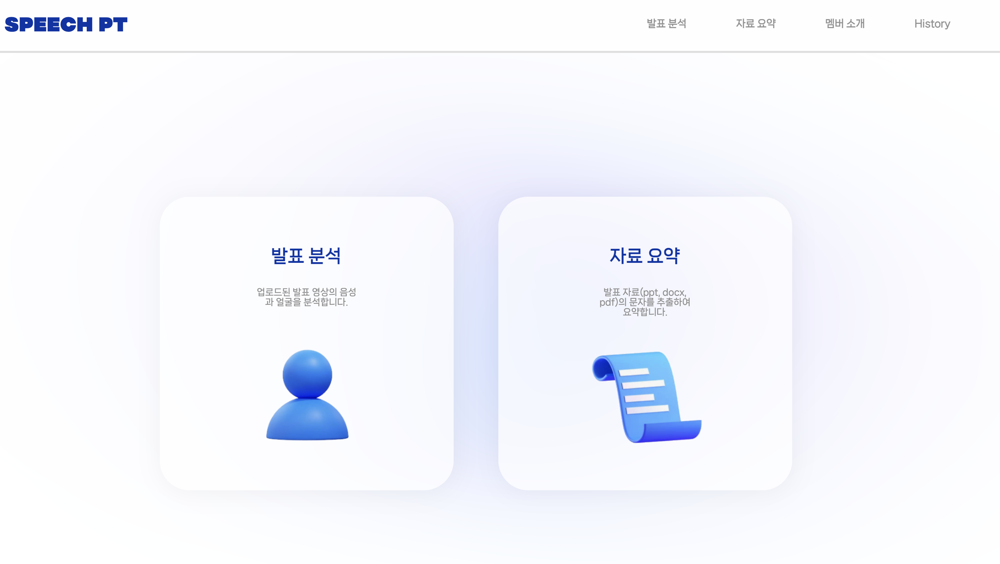
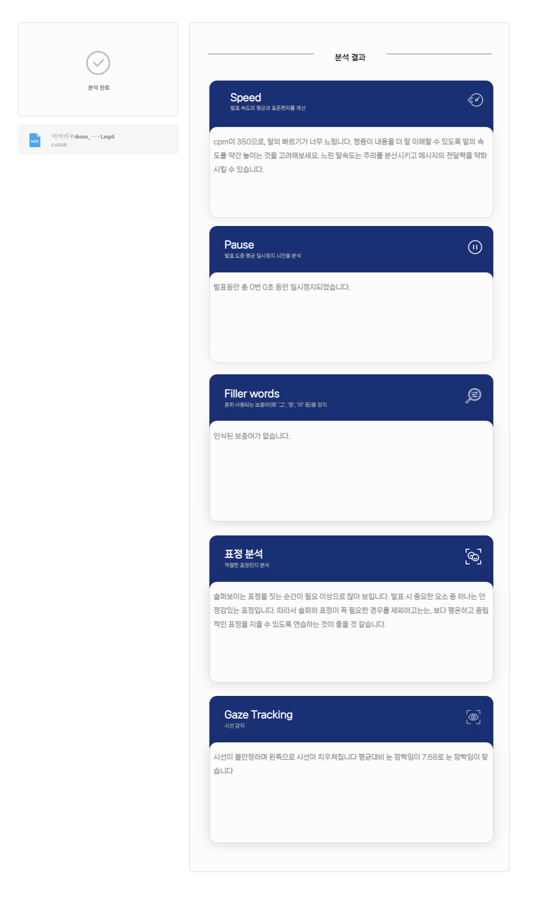
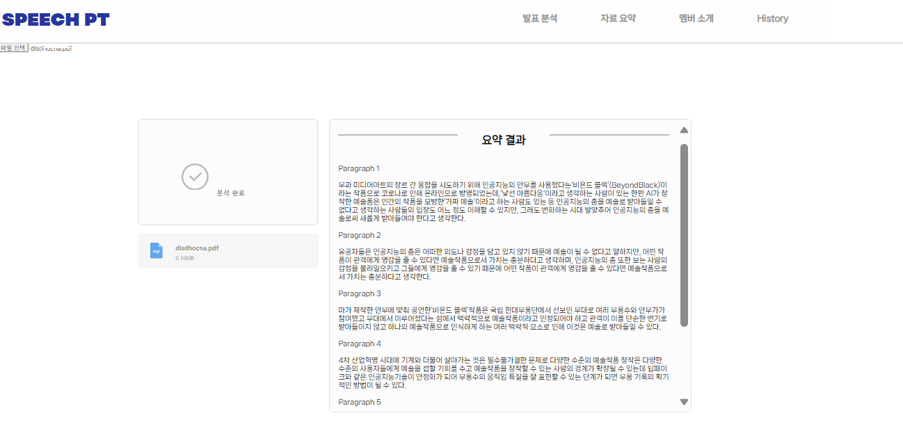

# SpeechPT
프로메테우스 AI 발표연습 어플리케이션 개발

## Table of Contents
* [General info](#general-info)
* [Technologies](#technologies)
* [Setup](#setup)
* [Members](#Members)


## How to Use
1. Clone the repository :
```
git clone https://github.com/use08174/SpeechPT.git
```

2. Install dependencies:
```
pip install -r requirements.txt
```

3. Start the development server:
```
cd SpeechPT/backend/app
uvicorn main:app --reload
```

## Key Features
Our project has two key features: 'presentation analysis' and 'text summarization'.





### Presentation analysis 
- Speed : Calculate cpm to analyze speed of the speech. 
- Pause : Calculate number of pauses and duration of pauses during speech.
- Filler words : Detect korean filler words in the speech.
- Face Expression : Analyze face expression of the presenter.
- Gaze Tracking : Tracking gaze of the presenter.



### Text summarization
- Summarize text : Extracting and analyzing presentation materials.



## Our Project Archive
This is our notion page for our project archive. : 
[Notion](https://odd-polyester-d27.notion.site/AI-cdf2556e1b3d4c3698c93cc3a04f139f )

## Members
### 🎵 Audio 팀
- 심수민 
- 김수홍 
- 배아람 

### 🎥 Video 팀
- 문승현 
- 남승현 

### 📝 Text 팀
- 윤선미 
- 임서연 


More about Prometheus : https://prometheus-ai.net/
